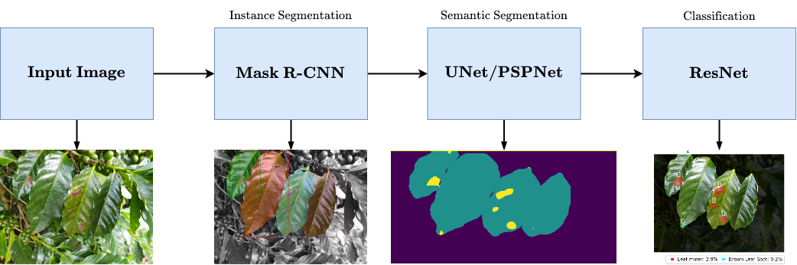

# A Deep Learning Approach Combining Instance and Semantic Segmentation to Identify Diseases and Pests of Coffee Leaves from In-Field Images

Code for the paper "A deep learning approach combining instance and semantic segmentation to identify diseases and pests of coffee leaves from in-field images".

Paper link: [Here!](https://www.sciencedirect.com/science/article/abs/pii/S0168169921002088)

## How to Run

The codes in this repository are ready to be used in the Google Colab environment. Just change the paths to your own.

## Proposed Framework



## Citation

If you use this code in your research, please cite:
```bibtex
@article{tassisetal-2021,
title = {A deep learning approach combining instance and semantic segmentation to identify diseases and pests of coffee leaves from in-field images},
journal = {Computers and Electronics in Agriculture},
volume = {186},
pages = {106191},
year = {2021},
issn = {0168-1699},
author = {Lucas M. Tassis and João E. {Tozzi de Souza} and Renato A. Krohling},
}
```
